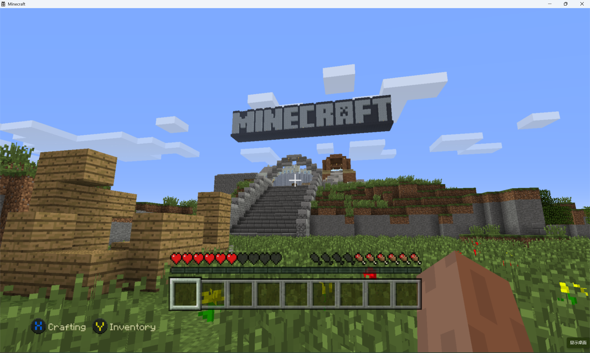

# MinecraftConsoles

## Introduction

This project contains the source code of Minecraft Legacy Console Edition v1.3.0494.0, with some fixes and improvements applied.

## Features

- Fixed compilation and execution in both Debug and Release mode on Windows using Visual Studio 2022
- Added support for keyboard and mouse input
- Added fullscreen mode support (toggle using F11)
- Disabled V-Sync for better performance

## Build & Run

1. Install Visual Studio 2022
2. Clone the repository
3. Open the project by double-clicking `MinecraftConsoles.sln`
4. Make sure `Minecraft.Client` is set as the Startup Project
5. Set the build configuration to **Debug** or **Release** and the target platform to **Windows64**, then build and run

## Known Issues

- Builds for other platforms have not been tested and are most likely non-functional
- Sound effects are missing
- Other unknown issues may exist